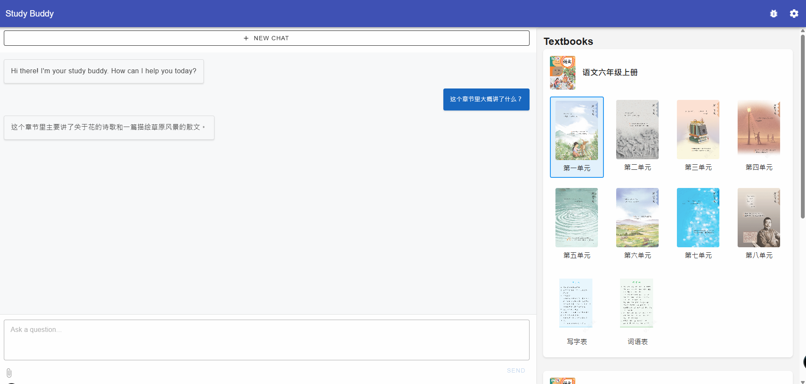
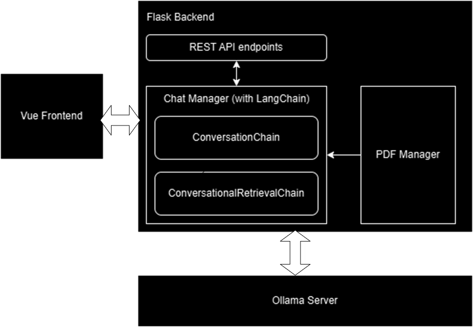

# Study Assistant with LLM

This web application is an AI-driven study assistant built with Vue and Ollama, designed to enhance productivity and streamline the learning process. Leveraging a dedicated backend powered by LangChain, the app offers interaction with chat history management, image reading capabilities, and contextual understanding of PDF documents. We can also pre-process textbook PDFs and let the user to select specific chapters directly through the UI, allowing the backend to retrieve and provide relevant context to the language model.



## Setup
Clone the repository and finish the following steps.

### Setup Ollama
Install Ollama and pull one or more large language models.

### Setup the frontend
Install frontend dependencies:
```bash
cd ollama-chat-app
npm install
```

### Setup the backend
```bash
cd ollama-chat-app/backend
pip install -r requirements.txt
```
Install chromadb separately
```
pip install chromadb
```

## Run

### Start Ollama
```bash
ollama serve
```

### Start the backend server
```bash
cd ollama-chat-app/backend
python app.py
```

### Start the frontend development server
```bash
cd ollama-chat-app
npm run serve
```

Open your browser and navigate to `http://localhost:8080`

## Usage and Features

1. Select a model from the dropdown menu on the toolbar
2. If the selected model supports vision, you can upload an image
3. Enter your prompt in the text area and click "Send" or press Enter to send the prompt
4. Select textbook's chapters on the right to add context to the conversation

## System Design

### Application Design



The system adopts a frontend-backend separated architecture with the following core components:

1. **Frontend Interface**
   - Modern user interface built with Vue.js framework
   - Intuitive model selection, conversation interaction, and document management
   - Support for image upload and real-time conversation display

2. **Backend Service**
   - Intelligent processing engine built with Python and LangChain
   - Integration with Ollama local LLM service
   - Document preprocessing and context management
   - RESTful API endpoints

3. **Document Processing System**
   - Intelligent parsing and chapter extraction of PDF textbooks
   - Vector database storage for document content
   - Context-based intelligent retrieval

4. **Model Service**
   - Local LLM service provided through Ollama
   - Support for multiple model switching and configuration
   - Model inference and response generation

### Preprocessing Textbooks

The textbook preprocessing system implements a comprehensive PDF processing pipeline with the following features:

1. **Document Processing**
   - Batch processing of textbook PDF files
   - Document parsing and metadata extraction using PyPDF2
   - Automatic chapter order and hierarchy recognition
   - Support for incremental update mode with metadata-only updates

2. **Text Splitting & Vectorization**
   - Intelligent text splitting using RecursiveCharacterTextSplitter
   - Configured with 1000-character chunks and 200-character overlap
   - Text embedding generation using local Ollama model
   - Vector storage using ChromaDB

3. **Metadata Management**
   - Automatic extraction of PDF metadata (title, author, creation date, etc.)
   - Generation of unique document hashes for version control
   - Support for textbook covers and chapter preview images
   - Maintenance of textbook and chapter hierarchy

4. **Index Generation**
   - Automatic generation of textbook directory structure
   - Content organization by chapter order
   - JSON format index file generation
   - Support for multiple textbook management and retrieval
